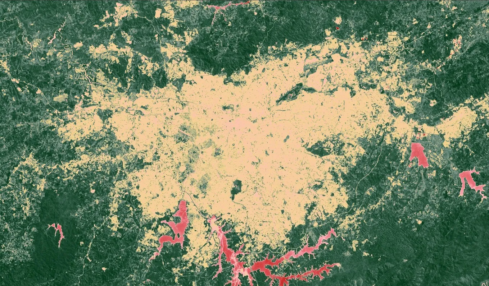
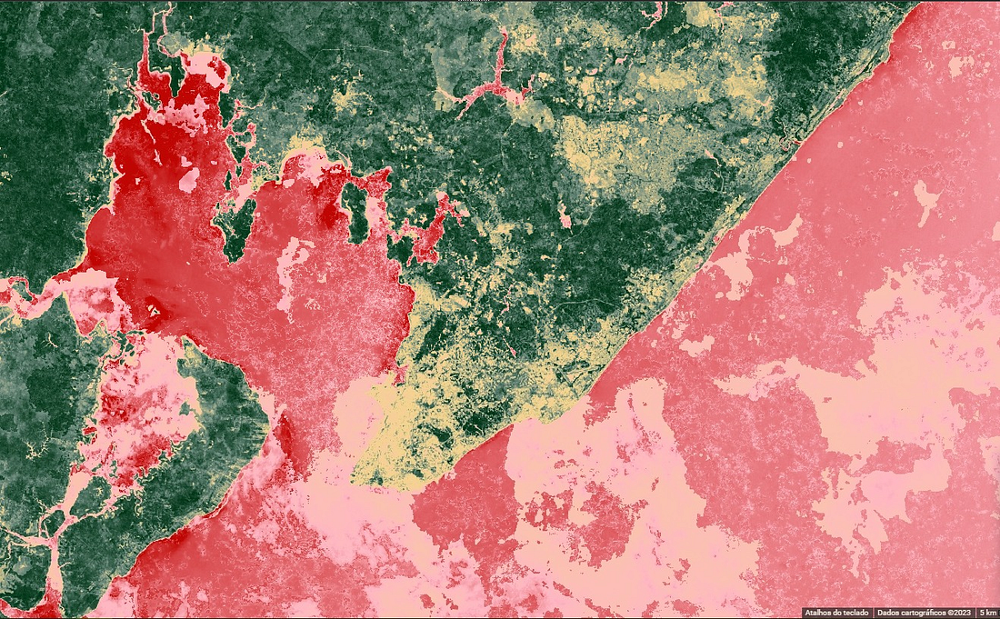
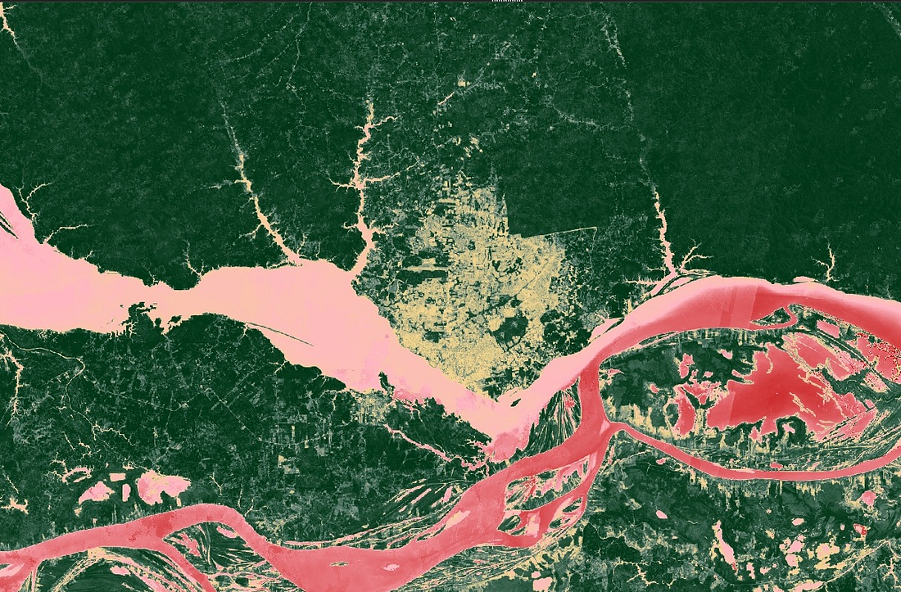

# Google Earth Engine - Extração de imagens Landsat

O texto original está disponível no meu [Medium](https://medium.com/@lisses/aprimorando-leituras-urbanas-com-sensoriamento-remoto-de-um-jeito-simples-2733d519cce8), o código em javascript para a realização da extração de NDVI e LST está disponível [no meu repositório](LST-L8-TOA-Calculation.js)

- [Google Earth Engine - Extração de imagens Landsat](#google-earth-engine---extração-de-imagens-landsat)
  - [0. Situando esse trabalho](#0-situando-esse-trabalho)
  - [1. Criando uma geometria](#1-criando-uma-geometria)
  - [2. Selecionando a coleção de imagens e aplicando os filtros](#2-selecionando-a-coleção-de-imagens-e-aplicando-os-filtros)
  - [3. Removendo as nuvens](#3-removendo-as-nuvens)
  - [4. Criando o NDVI](#4-criando-o-ndvi)
  - [5. Visualizando o mapa com o NDVI](#5-visualizando-o-mapa-com-o-ndvi)
  - [6. Salvando a imagem](#6-salvando-a-imagem)

 
## 0. Situando esse trabalho
Nesse texto o objetivo é obter o NDVI de uma determinada área. Caso você nunca tenha ouvido falar na sigla, o NDVI — Índice de Vegetação de Diferença Normalizada — é um índice de vegetação que ajuda a verificar a quantidade de área verde e a saúde de uma vegetação, ele é amplamente utilizado em contextos de agricultura, por exemplo, mas nos estudos urbanos pode ser utilizado para a verificação da presença de área verde durante um determinado período. Com esse índice dá pra verificar, por exemplo a supressão da vegetação ao longo do tempo em uma cidade ou até mesmo a criação de novas áreas verdes urbanas (embora, sendo sincero, nunca vi acontecer o segundo caso).

O NDVI é obtido a partir de um cálculo matemático que considera as bandas espectrais de infravermelho em imagens de sensoriamento remoto (aquelas ondas de luz que estão em uma frequência do espectro eletromagnético que o olho humano não consegue ver, caso essas palavras assustem, lembre das suas aulas de [física](https://www.miniphysics.com/electromagnetic-spectrum_25.html) do ensino médio)

Para o cálculo do NDVI diretamente no computador são necessárias as fotos de satélite e um pouquinho de conhecimento em programação (nesse caso, Javascript, também dá pra fazer tudo em Python, com pouca alteração no código). Tudo é feito através do [Google Earth Engine](https://earthengine.google.com/), uma plataforma da Google que não apenas mantém em catálogo milhares de fotos de satélite que se estendem desde décadas atrás até os dias atuais, mas também possibilita o cálculo em tempo real em cima dessas fotos, a partir do uso de programação.

O trabalho de programação é todo realizado na tela do [Code Editor](https://code.earthengine.google.com/) do Google Earth Engine. Esse editor permite visualizar simultaneamente a área onde vamos escrever o nosso código (na parte superior da tela) e o mapa resultante do processo (logo abaixo da caixa de texto).

Para obter o índice de vegetação vamos utilizar imagens do [Landsat 8](https://developers.google.com/earth-engine/datasets/catalog/landsat-8) que tira fotos da terra a cada 2 semanas, aproximadamente, Essas fotos têm resolução de 30m/pixel, o que significa que 1 pixel na imagem equivale a 30m na vida real, então já vou adiantando que esse mapa não vai mostrar o jardim no quintal da sua casa (a menos que ele seja um jardim extraordinário).

## 1. Criando uma geometria
A primeira parte é simples, mas super importante: vamos criar uma geometria para indicar a região de onde queremos obter as imagens de satélite, essa geometria pode ter qualquer forma e. no nosso caso, é um retângulo marcado bem em cima da cidade de São Paulo, ela também não precisa demarcar o perímetro exato da nossa área de estudo.

<p align="center">
  
</p>


Quando uma geometria é criada, o Google Earth Engine cria automaticamente uma variável com os dados de localização e tamanho da forma, a variável sempre tem o mesmo nome que o indicado para a forma no mapa e fica disponível para visualização no Code Editor.

## 2. Selecionando a coleção de imagens e aplicando os filtros
Vamos começar selecionando a coleção de imagens que vamos utilizar: Como já havia adiantado, utilizamos a coleção 8 do satélite Landsat, na versão “Topo da atmosfera” (uma versão especial em que o Google já fez algumas das alterações que seriam necessárias para a obtenção dos mapas de vegetação e temperatura), como estamos fazendo um código javascript, precisamos armazenar a informação da coleção escolhida em algum lugar, no caso, uma variável:

```javascript
var col = ee.ImageCollection("LANDSAT/LC08/C02/T1_TOA")
```
Assim, indicamos que a variável col é uma coleção de imagens do catálogo do GEE

Imagine que você está em uma galeria, verificando um álbum com milhares de fotos, dos mais diversos tipos, nessa situação você vai tentar encontrar a foto por meio de um filtro, certo? Talvez pela data ou pelo local da foto? No caso do GEE essa lógica também se aplica e o programa provavelmente levaria horas até vasculhar todas as imagens geradas por satélites, assim, é essencial criarmos filtros.

Os filtros são criados em cima da coleção de imagens que selecionamos e podem ser relacionados com o local e o período das fotos, bem como com o percentual de nuvens e outros parâmetros.

```javascript
  var col = ee.ImageCollection("LANDSAT/LC08/C02/T1_TOA") 
    .filterDate('2022-01-01', '2022-12-31') //Filtro de período: ano de 2022
    .filterBounds(geometry) // A área filtrada é obtida a partir da geometria feita no GEE, é necessário utilizar a ferramenta "geometria" da própria plataforma
    .filter(ee.Filter.lt('CLOUD_COVER',20)) //Filtra as imagens a partir do percentual de cobertura de nuvens
    .map(cloudmask) // Aplica a função de masking nas nuvens que apareceriam nas imagens
    .median();
```
Nesse caso, diminuímos a seleção apenas para o ano de 2022 e próximas da geometria feita anteriormente, além disso, eliminamos todas as imagens que estejam cobertas por nuvens em mais de 20% da área da foto. Também transformamos a coleção de imagens em uma imagem só, que é a mediana dos valores identificados nos pixels de todas as imagens na coleção (pode parecer contra intuitivo, mas é só lembrar que todos os pixels de uma fotografia são dados numéricos).

## 3. Removendo as nuvens
Se você reparou bem no código anterior, provavelmente deve ter boiado na penúltima linha, onde aplico uma função chamada cloudmask. Se esse foi o caso, a culpa é toda minha, já que criei a função anteriormente no código.

Por mais lindas que as nuvens sejam quando vistas daqui de baixo, na escala dos satélites as nuvens podem estragar um imagem inteira quando fazem photobomb na foto que não foram chamadas. Piadas à parte, é comum que nuvens apaguem toda a imagem do satélite, especialmente em períodos mais úmidos, como o verão.

Para lidar com o problema das nuvens, eu aplico o cloudmask em toda a imagem através do método .map() do javascript, essa é uma função simples, mas especial: o que o código faz é remover as nuvens que aparecem na imagem, assim como as sombras delas.

```javascript
function cloudmask(image) {
    var qa = image.select('QA_PIXEL');
    var cloudMask = qa.bitwiseAnd(1 << 3).neq(0) // Sombra de nuvem
                   .or(qa.bitwiseAnd(1 << 5).neq(0)); // Nuvem
    return image.updateMask(cloudMask.not());
  };
```

É difícil imaginar como isso acontece mas, de maneira bem simplificada, é como se cada fotografia do Landsat 8 viesse com uma outra imagem que contém informações sobre a qualidade dos pixels, essa imagem indica, por exemplo nuvens, sombras, água e outros elementos e atribui códigos numéricos para os mesmos. Assim, é possível mascarar cada pixel a partir de uma propriedade indicada nessa imagem auxiliar, fazendo um filtro a partir do código numérico.

Mais pode ser verificado na página 11 [desse documento](https://developers.google.com/earth-engine/datasets/catalog/LANDSAT_LC08_C02_T1_L2). No caso do nosso conjunto de imagens, a imagem auxiliar é essa “QA_PIXEL”.

## 4. Criando o NDVI
Com as imagens selecionadas e o filtro de nuvens aplicado, é hora de criar o índice de vegetação a partir do NDVI. A boa notícia é que, para o caso de imagens Landsat, essa é a etapa mais fácil, já que o GEE possui um método em sua biblioteca que realiza o cálculo automaticamente. Ainda assim, é legal entender como o NDVI é calculado: ele é obtido através da relação de duas bandas espectrais da imagem, a da luz vermelha (RED) e a do espectro de luz do infravermelho próximo (NIR) (que o olho humano não consegue visualizar) a partir da seguinte relação:

NDVI = (NIR — RED)/(NIR+RED)

O que o NDVI faz é normalizar a diferença entre as duas bandas na imagem em uma base numérica que vai de -1 a 1 (e, olhando por esse lado, o nome do índice faz bastante sentido) sendo que os valores mais próximos de 1 podem ser um indicativo de maior presença de vegetação e vegetação mais densa, enquanto valores mais próximos do 0 normalmente são relacionados às áreas sem vegetação.

Valores negativos normalmente indicam corpos d’água, nuvens ou quaisquer outros elementos que são estranhos ao índice.

O código para a obtenção do NDVI é o seguinte:

```javascript
var ndvi = col.normalizedDifference(['B5', 'B4']).rename('NDVI')
```

## 5. Visualizando o mapa com o NDVI
Essa é, provavelmente, a parte mais legal. Com a variável de NDVI criada, basta colocar a camada de processamento dela em cima do mapa para visualizarmos o resultado (quase como o que acontece quando modificamos o tipo de mapa no Google Maps). Para adicionar a camada com o cálculo de NDVI, basta adicionar a linha abaixo e rodar o código:

```javascript
Map.addLayer(ndvi)
```

Se deu tudo certo, agora é hora de ativar a layer no canto superior direito do mapa. É essencial modificar o range dos valores para o mínimo e máximo do NDVI, nesse caso eu coloquei como entre -1 e 1, mas o GEE possibilita modificar o alcance para os valores máximos e mínimos encontrados dentro da foto (que muito provavelmente serão diferentes de -1 e 1)

<p align="center">
  
</p>


Na imagem gerada, as áreas mais brancas têm NDVI menor, enquanto áreas mais escuras tem aumento do índice de vegetação. É possível modificar as cores do mapa e mesmo adicionar novas paletas, essas são algumas que fiz com o mesmo código


São Paulo/SP


Salvador/BA


Manaus/AM

Nesse caso eu fiz a paleta de cores com apenas 5 tons e coloquei uma cor bem vermelha nos valores negativos pra dar um destaque legal nos corpos d’água do mapa (e também pra parecer uma obra de arte, admito que tentei). É muito evidente nos mapas que as áreas urbanizadas possuem consideravelmente menos vegetação, o range do índice nos três mapas está entre cerca de -0,4 e 0,7.

## 6. Salvando a imagem
Eu salvei a imagem diretamente no meu drive, com o código abaixo. A imagem é salva no formato GEOTIFF, ideal para utilização em outros softwares de GIS.

```javascript
 Export.image.toDrive({
  image:ndvi, //Variável da imagem a ser salva
  description: "2022-NDVI", //Nome do arquivo
  scale: 30, //Resolução
  region: geometry //Área da imagem
})
```